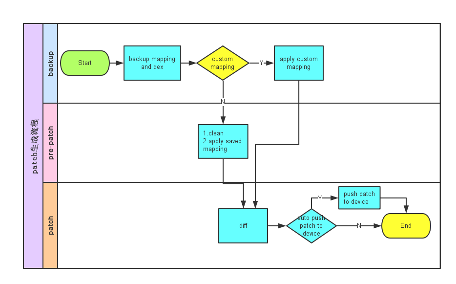
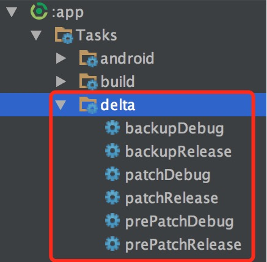
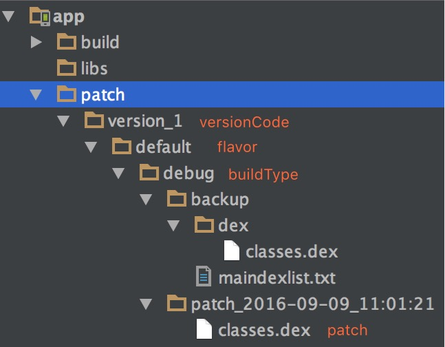

[](https://bintray.com/byteam/maven/delta/_latestVersion) [](https://android-arsenal.com/api?level=8) [](http://www.apache.org/licenses/LICENSE-2.0.html)

[中文wiki](https://github.com/byteam/delta/wiki)


> Delta offers your android app the hot fix and incremental upgrade powers.

## Principle

Inspired by wechat's [Tinker](http://bugly.qq.com/bbs/forum.php?mod=viewthread&tid=1264&extra=page%3D1), please check this page for more information.



## Features

1. Kind to developers and easy to use.
2. Hot fix and incremental upgrade(on the schedule).
3. Supports all platform versions.
4. Fine compatibility.
5. Negligible performance cost.

## To be improved

1. Verify patch file.
2. Handle exception.
3. Incremental upgrade.
4. It's up to you.

## How to get

In your project's `build.gradle`

```
buildscript {
    repositories {
        jcenter()
    }
    dependencies {
        classpath 'com.android.tools.build:gradle:x.y.z'
        classpath 'org.byteam.delta:delta-gradle-plugin:x.y.z'
        ...
    }
}
```

In your application module's `build.gradle`

```
apply plugin: 'com.android.application'
apply plugin: 'delta'
...
delta {
    enable true
    autoPushPatchToDevice true // for test
}
```

## Configurations

Avaliable options:

|    option     |     type     |     usage     |     default     |
|:---:|:---:|:---:|:---:|
|enable|boolean|enable delta or not|false|
|versionCode|int|specify application's version code|variant's version code|
|deltaVersion|String|specify delta library's version|same as plugin version|
|maxNumberOfIdxPerDex|int|max number of methods in per dex|0xFF00|
|mapping|String|specify the mapping file|null|
|autoPushPatchToDevice|boolean|auto push patch to device rom, used for test|fale|

## Generate patch dex

The delta gradle plugin will create some tasks:



1. Execute backup task to backup the dex and mapping files for future usage.
2. Find bugs, fix it(change some code).
3. Execute patch task, this task will apply existing mapping or specifed mapping and generate a new dex, then produce the final patch.

The final patch directory looks like this:




## How to use

In your own `Application`:

```
public class App extends Application {

    @Override
    protected void attachBaseContext(Context base) {
        super.attachBaseContext(base);
        // Install existing patch
        Delta.install(this);
    }

    ...
}

/**
 * 从手机内存中合并patch,一般用于测试,切勿在正式环境中使用.
 *
 * @param context Context
 */
Delta.applyPatchFromDevice(Context context);

/**
 * 合并指定的patch. 该操作为耗时操作,建议放到非UI线程执行.
 *
 * @param context  Context
 * @param patchDex patch文件
 */
Delta.applyPatch(Context context, File patchDex);

/**
 * 删除所有热补丁.
 *
 * @param context  Context
 */
Delta.clean(Context context;

```
## License

[Apache 2.0](http://www.apache.org/licenses/LICENSE-2.0.html)
